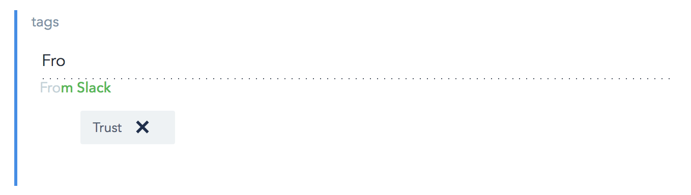

# Autocompleting Tags in Contentful

[Contentful](https://www.contentful.com) is a content management platform. It has a concept of *Tags*, and these fall into their "content as metadata" approach. This means that *Tags* are just another type of [Short-Text Field](https://www.contentful.com/developers/docs/concepts/data-model/) you can add, as a [List](https://www.contentful.com/developers/docs/concepts/data-model/#array-fields). Contentful has a [Tag style appearance](https://www.contentful.com/developers/docs/concepts/editor-interfaces/]) choice for these.

## But they don't autocomplete!
In my experience, Tags are most useful when they autocomplete as you type things. This lets you keep some kind of consistency in your Tags across documents. Without autocomplete, you end up having "Spiderman" and "Spider man" and "Spider Man" as three different Tags 😱️

*This UI extension adds a rendering option for Autocompleting tags to Contentful.*



## Where do the tags come from?
Any documents in the Space which have a field called "tags" will be searched for. Their contents will then become the autocomplete suggestions for the document you're editing.

## Installation and usage
This uses Contentful's Extensions SDK.
You need to have `npm` and `gulp` installed to use this, and [have the extensions SDK installed](https://github.com/contentful/ui-extensions-sdk).

Clone or fork this repository.

Install the dependencies needed with `npm install`.

Create a _.env_ configuration file with your Contentful credentials:

```bash
export SPACE_ID=<space-id>
export CONTENTFUL_MANAGEMENT_ACCESS_TOKEN=<content-management-access-token>
```

Add the variables to your environment.

```bash
source .env
```

## Upload the extension to Contentful

Create the extension in the space specified in the _.env_ file:

```bash
npm run create
```

## Local development

_This doesn't work if you have web security enabled in your browser, since your localhost will be serving on HTTP. This is probably the case for you. It is possible to disable it, or just `npm run update` your code to the server every time!_

Start a local server, changing the port if needed:

```bash
python -m SimpleHTTPServer 3030
```

Tell Contentful to render the widget from your local machine:

```bash
npm run dev
```

## Update the extension

If you want to update the extension after your edit the code, run:

```bash
npm run update
```

## Using the extension in the Contentful web app

Enable the extension in the Contentful web app for a "Short text" field (with "List" selected too) by opening the _Settings_ for a field and selecting this widget in the _appearance_ tab.